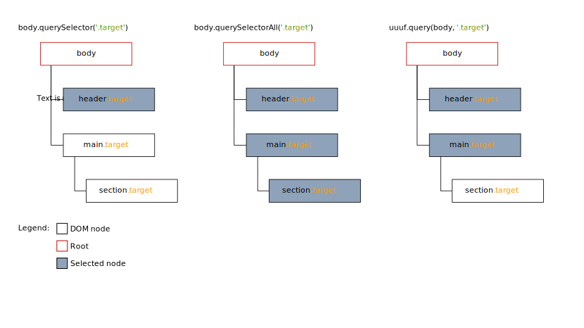
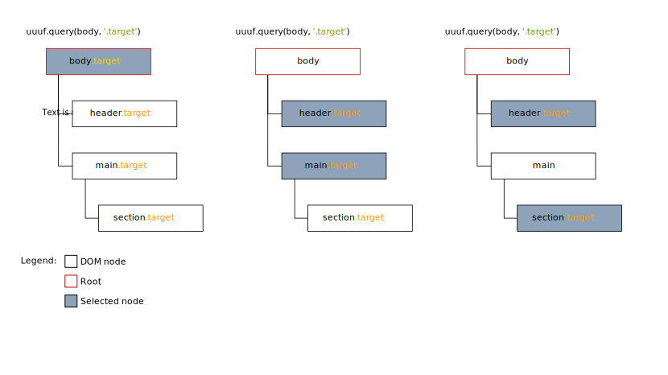

# Table of contents

- [Overview](#overview)
- [Setup](#setup)
- [Documentation](#documentation)
- [Contribute](#contribute)
- [Examples](#examples)

# Overview

uuuf is a simple, js only, behavior component framework.

It's goal is to ease development of frontend behavior for projects where other more powerful frameworks (es: React) can't be used for whatever reason.

uuuf is not going to replace other frameworks, and how you handle templates, styles or state management is entirely up to you.

## Quick Example

Given this html (doesn't matter how it's generated as long as is available when uuuf loads):

```html
<div data-js-component="Counter">
    <button type="button" data-dec-btn="10">dec by 10</button>
    <button type="button" data-dec-btn="1">dec by 1</button>
    <span class="amount" data-amount></span>
    <button type="button" data-inc-btn="1">inc by 1</button>
    <button type="button" data-inc-btn="10">inc by 10</button>
    <div>
        <button type="button" data-set-btn="0">reset</button>
        <button type="button" data-set-btn="100">set to 100</button>
    </div>
</div>
```

This is the component that handles the counter logic (`component/Counter.js`):

```js
import { Component, $$ } from 'uuuf'

class Counter extends Component {
    get CSS() {
        return {
            tooMuch: 'amount--toomuch'
        }
    }

    get DOM() {
        return {
            amount: '[data-amount]',
            ctas: {
                inc: [$$`[data-inc-btn]`, {
                    click: this.handleIncrement
                }],
                dec: [$$`[data-dec-btn`, {
                    click: this.handleDecrement
                }],
                set: [$$`[data-set-btn]`, {
                    click: this.handleSet
                }]
            }
        }
    }

    async ready() {
        this.bind();
        this.amount = 0;
    }

    handleIncrement(evt) {
        const btn = evt.currentTarget
        const amount = Number(btn.dataset.incBtn)
        this.amount += amount;
        this.updateAmount();
    }

    handleDecrement(evt) {
        const btn = evt.currentTarget
        const amount = Number(btn.dataset.decBtn)
        this.amount -= amount;
        this.updateAmount();
    }

    handleSet(evt) {
        const btn = evt.currentTarget
        const amount = Number(btn.dataset.setBtn)
        this.amount = amount;
        this.updateAmount();
    }

    updateAmount() {
        // print value
        this.dom.amount.innerHTML = this.amount;
        // apply css class if amount is > 100, remove if <= 100
        this.css.tooMuch(this.dom.amount, this.amount > 100);
        // disable inc buttons if amount is > 100, enable if <= 100
        this.dom.ctas.inc.forEach(e => e.disabled = this.amount > 100);
    }
}
```

# Setup

uuuf is very flexible about how you load components into the application. This is the reason you have to do come configuration prior to using it.

Given the following project structure:

```
myproject/
├── node_modules/
│   ├── ...
│   └── uuuf/
├── components/
│   └── HelloWorld.js
├── loadComponents.js
├── index.js
└── index.html
```

This is how you initialize uuuf into your application:

`loadComponents.js`:
```js
import { makeLoadComponents } from 'uuuf';

async function importComponent(componentName) {
    // this is an example with webpack dynamic imports
    return import(`@/components/${componentName}`).then(mod => mod.default);
}

export default makeLoadComponents(importComponent);
```

`components/HelloWorls.js`:
```js
import { Component } from 'uuuf'

class HelloWorld extends Component {
    async ready() {
        console.log('hello, world!')
    }
}
```

`index.js`:
```js
import loadComponents from './loadComponents';

loadComponents(document.body);
```

# Documentation

## Principles

uuuf was designed with a few principles that might diverge from typical vanilla js development that are worth keeping in mind:

1. Automatic method binding

Methods declared in a component are automatically bound to the component instance.
This removes the need to keep track of the execution context and allows methods to be called worry-free from anywhere you need.

2. Declarative syntax for DOM access

You might have noticed the lack of `querySelector/querySelectorAll` methods in the previous examples. This is because you specify what you want and with which name in the `DOM` getter. Obviously uuuf uses `querySelector` and `querySelectorAll` behind de curtains, but that is entirely abstracted away.

You can and should still use them from time to time, especially for niche situations. But most of the time, you're fine with `DOM` getter.

3. Component responsibility

Each component should handle itself and is responsible for the DOM portion it is attached to. This means that in a parent-child relationship between component, the parent component is responsible for child components loading. Each component instance is by default attached to the DOM element it controls, which ease access from external code and other components.

Loose coupling is fine, and tipically comunication is done in two fashions:

- top-down: use method calls on receivng component
- bottom-up: emit events from calling component

4. Query strategy

In order to ease component responsibility, `querySelector` and `querySelectorAll` aren't really a good fit for the purpouse. Imagine this scenario:

```html
<ul data-js-component="List">
    <li class="level-1" data-js-component="ListItem">
        <ul data-js-component="List">
            <li class="level-2" data-js-component="ListItem"></li>
        </ul>
    </li>
    <li class="level-1" data-js-component="ListItem"></li>
</ul>
```

If `List` component had access only to `querySelector` and `querySelectorAll`,
and wanted to get a reference to it's `.level-1` `ListItem` children, we have some problems:

1. `querySelector('[data-js-component="ListItem"]')` only matches the first one
2. `querySelectorAll('[data-js-component="ListItem"]')` would match also `.level-2` items, breaking the component responsibility principle.
3. use `querySelectorAll('.level-' + level)`, which complicates desing of the component (and is not encouraged, since css class should only handle styles).

This is why uuuf implements a custom query stategy, called `uuuf.query`, which goes as follow:

1. starts from a given root, which can be a either a list of elements or a single one (it will be normalized to a list of elements)
2. for each element in the given root, check if the element matches the given css selector
3. if an element matches, collect the element and stop
4. otherwise, descend into its children and use them as the new root for the next recursion step

A wise man once said a picture is worth a thousand words, so let's double that:




## Reference

### Framework functions

> ```ts
> uuuf.makeLoadComponents(
>     importComponent: async (componentName: string) => Promise<ComponentClass>,
>     {
>         componentSelector?: string,
>         getComponentName?: (elem: HTMLElement) => string,
>     }
> ) => LoadComponentsFn
> ```

This function creates a `loadComponents` function used to import components at runtime.

`importComponent` is the only mandatory parameter, which handles how a component is imported given it's name.

`componentSelector` defaults to `[data-js-component]` and must be a valid css selector.

`getComponentName` is tasked with the extraction of the component name from the element. Defaults to `elem => elem.dataset.jsComponent`

> ```ts
> async loadComponents(
>     root: HTMLElement | HTMLElement[] | HTMLCollection,
>     extraPredicate?: (elem: HTMLElement) => boolean
> ) => Promise<void>
> ```

This function searches components in the dom starting from `root`.

`extraPredicate` can be a optional predicate function to further exclude matches.

> ```ts
> uuuf.query(
>     root: HTMLElement | HTMLElement[],
>     predicate: string | ((e: HTMLElement) => boolean)
> ): HTMLElement[]
> ```

The function implementing the query strategy explained in the 4th design principle.

If `predicate` is a string, it must be a valid css selector.

> ```ts
> uuuf.$$
> ```

String template tag used in `this.DOM` to express usage of `uuuf.query` as strategy.

> ```ts
> uuuf.$ALL
> ```

String template tag used in `this.DOM` to express usage of `elem.querySelectorAll` as strategy.

> ```ts
> uuuf.$DOC
> ```

String template tag used in `this.DOM` to express usage of `document.querySelector` as strategy.

> ```ts
> uuuf.$$DOC
> ```

String template tag used in `this.DOM` to express usage of `document.querySelectorAll` as strategy.

> ```ts
> uuuf.$UP
> ```

String template tag used in `this.DOM` to express usage of `elem.closest` as strategy.

> ```ts
> uuuf.emit(
>     elem: HTMLElement,
>     name: string,
>     detail: any,
>     bubbles = true
> )
> ```

Helper function to emit custom events on DOM elements.

### Component class

> ```ts
> class Component {
>     // Getters
>     get CSS(): ObjectTree<string> {
>         return {
>             /*
>             myClass: 'my-class',
>             */
>         };
>     }
>
>     get DOM(): ObjectTree<DOMDefinition> {
>         return {
>             /*
>             myElement: '[data-my-element]',
>             myElement: ['[data-my-element]', {
>                 click: () => console.log("hello, world!"),
>             }],
>             myGroup: {
>                 mySubGroup: {
>                     elem1: '[data-elem-1]',
>                     elem2: ['[data-elem-2]', {
>                         click: () => console.log("hello, world!"),
>                     }]
>                 }
>             },
>             */
>         };
>     }
>
>     // Component lifecycle
>     constructor(elem: HTMLElement)
>
>     async ready()
>
>     // Methods
>     select()
>
>     bind()
>     unbind()
>
>     emit(name: string, detail: any, bubbles = true)
>
>     is(e: any): boolean
>
>     async mix(component: string | Component, elem = this.elem): Promise<Component>
>
>     // Public fields
>     elem: HTMLElementComponent;
>     args: { [key: string]: any };
>     css: ObjectTree<CSSClass>;
>     dom: ObjectTree<QueryResult>;
> }
> ```

Dat chunky boi is the base class to extend into your components.

> ```ts
> get CSS(): ObjectTree<string>
> ```

Should return an object that mimics a tree, whose keys are user defined names and values can be either other object-trees or strings that will be transformed into css class helpers.

The result with the css class helpers is exposed as `this.css`

> ```ts
> get DOM(): ObjectTree<DOMDefinition>
> ```

Similar to `get CSS`, but leaves can either be:
- a string representing a valid css selector
- a `$$` or `$ALL` tagged string representing a valid css selector
- a tuple which first element is either a simple or `$$`/`$ALL` tagged string, and second element is a object whose keys are event names and values are corresponding event handlers.

When `this.select()` is invoked, it reads `this.DOM` to get the list of dom nodes to retrieve. Depenging on which kind of string is supplied as value or as first element of the tuple, different strategies are used:

- simple string => `this.elem.querySelector(selector)`
- `$ALL` string => `this.elem.querySelectorAll(selector)`
- `$$` string => `uuuf.query(this.elem, selector)`

For multiple matches, `$$` is preferred over `$ALL`, as it helps ensuring component responsibility over the DOM. All strategies use the element on which the component is attached as the root of the search.

Results of the queries are exposed as `this.dom`, with the tree structure preserved.

When `this.bind` is invoked, first it automatically invokes `this.select`. Then, it reads only tuple leaves, and uses the second field to bind event handlers to the specified event on the matched element.

> ```ts
> constructor(elem: HTMLElement) => Component
> ```

The component constructor.

`elem` is the DOM element matched by `loadComponents` during initialization.

Initialization code should usually go into `async ready()`, since the order of component creation is not guaranteed, `this.dom`/`this.css` aren't initialized yet and async code in the constructor is uncomfortable to handle.

> ```ts
> async ready(): Promise<void>
> ```

`ready` is the main lifecycle method of a component, is called by `loadComponents` and serves three purposes:

1. run code after the component instance is created and attached to the dom
2. do component initialization duties, including loading other components if needed
3. signal to `loadComponents` that this component is ready and continue with initialization of the next component

By default, the implementation of this method is simply

```
async ready() {
    this.bind();
}
```

This method is meant to be overriden rather than extended, in order to give fine-grained control over what-happens-when (es: you might want to manipulate the dom before loading other components)

`loadComponents` ensures ordering upon `ready` calls, accordingly to `uuuf.query` result, which follows the DOM top to bottom, outer to inner (left to right).

> ```ts
> select()
> ```

This method reads `this.DOM` tree and queries the dom accordingly, recreating the tree structure with the results in `this.dom` property.

> ```ts
> bind()
> ```

This method reads `this.DOM` tree looking for event specifications, detaching registered events and attaching specified events.

Implicitly calls `this.select()` and `this.unbind()`.

Registered events are stored in `this._handler` (not meant for direct manipulation)

> ```ts
> unbind()
> ```

This method reads `this._handler` and removes the corresponding events.

> ```ts
> emit(name: string, detail: any, bubbles = true)
> ```

Helper method to emit custom events on the component's element.

Uses `uuuf.emit()`.

The event is emitted on `this.elem`.

> ```ts
> is(e: any): boolean
> ```

Utility method that checks if the given argument is the DOM element controlled by the component.

> ```ts
> async mix(component: typeof Component, elem = this.elem): Promise<Component>
> ```

Utility method that allows creation and initialization of other components inside a component, tipically done in `ready()`.

`component` is the class of the component to instantiate.

`elem` is the `elem` passed to `component` constructor. Defaults to `this.elem`

Returns a reference to the mixed-in component instance.

The mixed-in component is not attached to the DOM.

It's responbility of the mixin component to store the returned reference and to eventually re-expose mixed-in component's method.

> ```ts
> elem: HTMLElementComponent;
> ```

The element controlled by the component, to which is attached.

When `loadComponents` creates components, it stores a reference to the component instance on the dom node (`.component`, hidden). This mechanism allows comunication between components (es: methods calls) or from external code.

> ```ts
> args: { [key: string]: any };
> ```

An object containing initial data to use for custom component initialization. It's a `JSON.parse` of the attribute `data-args` on the component's element.

> ```ts
> css: ObjectTree<CSSClass>;
> ```

The object-tree storing `CSSClass`es

> ```ts
> dom: ObjectTree<QueryResuly>;
> ```

The object-tree storing DOM references

## Internal fuinction

uuuf exports internal utilities for advanced uses

### `uuuf.tree`

This module contains functions to manipulate object-trees

> ```ts
> uuuf.tree.get<A>(
>     tree: ObjectTree<A>,
>     path: string | string[],
> ): ObjectTree<A> | A | undefined
> ```

Returns the value of `tree` at a given `path`

> ```ts
> uuuf.tree.map<A, B>(
>     tree: ObjectTree<A>,
>     f: ObjtreeMapFn<A, B>
> ): ObjectTree<B>
> ```

Maps `f` to leaves of `tree`. Returns a new object-tree;

### `uuuf.css`

This module contains function for creating `CSSClass` objects

> ```ts
> uuuf.css.cssClass(className: string): CSSClass
> ```

Returns a function with signature

> ```ts
> cssClass(elem: HTMLElement, toggle?: boolean): boolean`
> ```

that applies `className` on a given `elem`.

`toggle` defaults to `true`. if `false`, it removes `className` from `elem`.

This function has also a couple of useful methods:

> ```ts
> cssClass.match(elem: HTMLElement) => boolean
> ```

Returns true if given `elem` has `className` applied

> ```ts
> cssClass.toString() => string
> ```

Returns `className`

### `uuuf.dom`

This modules containes functions to query the DOM

> ```ts
> uuuf.dom.query(
>     root: HTMLElement | HTMLElement[],
>     predicate: string | ((e: HTMLElement) => boolean)
> ): HTMLElement[]
> ```

Same as `uuuf.query`

> ```ts
> uuuf.dom.$$
> ```

Same as `uuuf.$$`

> ```ts
> uuuf.dom.$ALL
> ```

Same as `uuuf.$ALL`

> ```ts
> uuuf.dom.querySelect(
>     elem: HTMLElement,
>     selectorMap: ObjectTree<QuerySelector>
> ): ObjectTree<QueryResult>
> ```

This function is how `this.dom` is built.

`elem` is the root for `querySelector`, `querySelectorAll` and `uuuf.query` search.

`selectorMap` is an object-tree of `DOMDefinition`s. See `this.DOM`.

### `uuuf.events`

This module contains function for event manipulation

> ```ts
> uuuf.events.emit(
>     elem: HTMLElement,
>     name: string,
>     detail: any,
>     bubbles = true
> )
> ```

Same as `uuuf.emit`

> ```ts
> uuuf.events.bind(
>     elemTree: ObjectTree<QueryResult>,
>     handlerTree: ObjectTree<HandlerMap>
> ): ObjectTree<RemovableHandlerMap>
> ```

This is how `this.bind()` bind events on the dom.

`elemTree` is an object-tree of dom elements. Tipically `uuuf.dom.querySelect` output.

`handlerTree` is an object-tree of event definitons.

`elemTree` and `handlerTree` should have the same structure. Paths found in one tree but not in the other are ignored.

Returns an object-tree with the same structure as `handlerTree`, but event handlers are replaced with functions that remove the associated handler.

> ```ts
> uuuf.events.unbind(handlerMap: ObjectTree<RemovableHandlerMap>)
> ```

This function does the conceptual opposite of `uuuf.events.bind()`. It walks an object-tree of event handler remover and calls them.

`handlerMap` is tipically the output of `uuuf.events.bind()`

# Contribute

Contributions are welcome, but subjected to owner judgement.

Opening issues to discuss feature requests and bugfixes is the preferred way.

To build the library in production mode run

```npm run build```

To build the library in development mode run

```npm run dev```

or

```npm run watch```

# Examples

To run examples, run

```npm run examples```

and then navigate to the url provided in the console.

Some examles require to be built, refer to their respective `pakcage.json` or `README`.